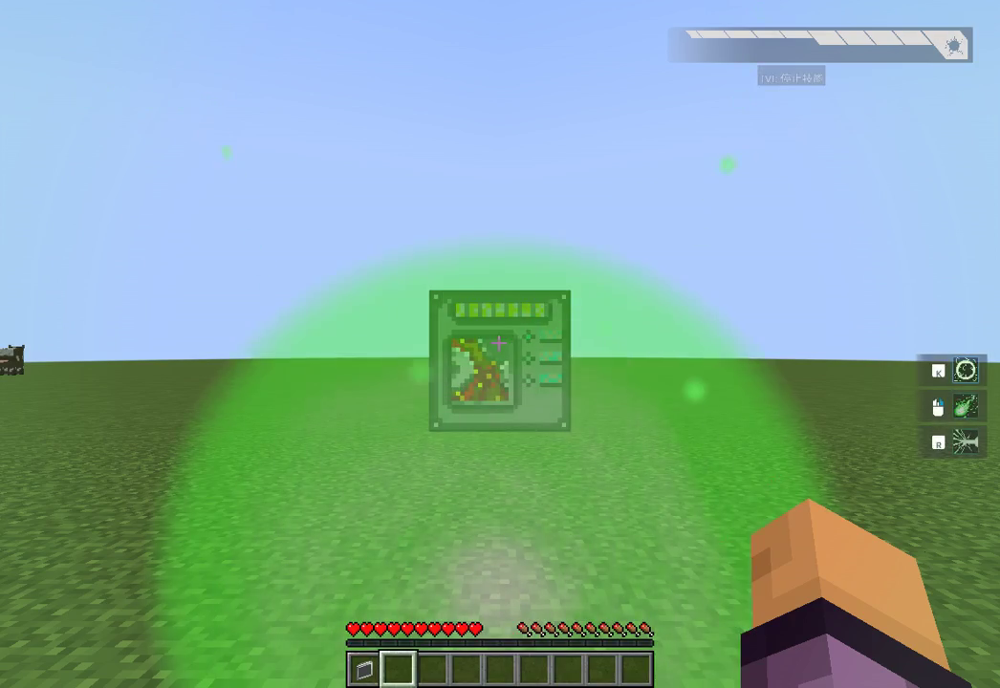
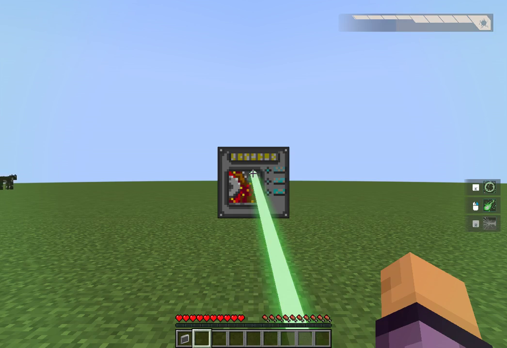
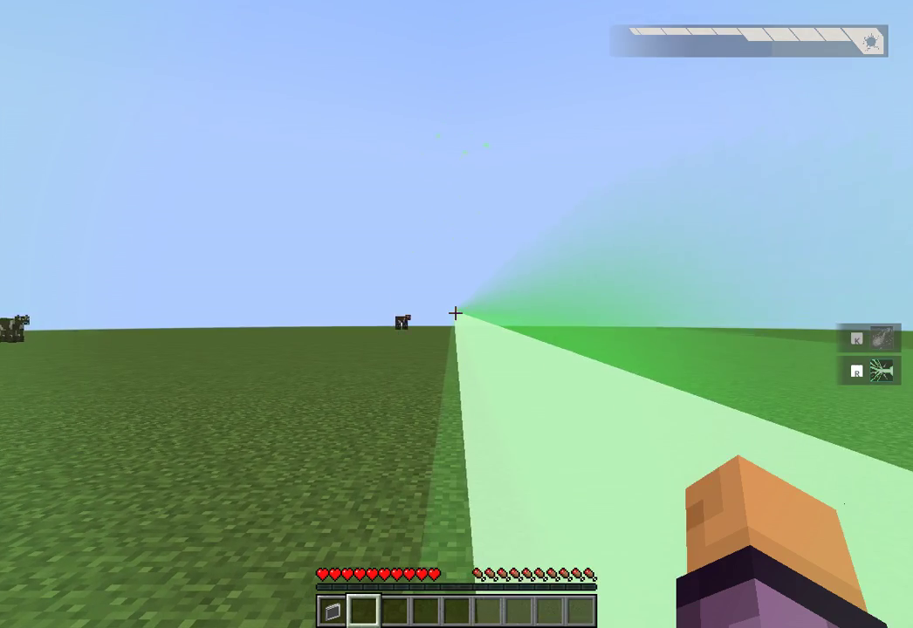
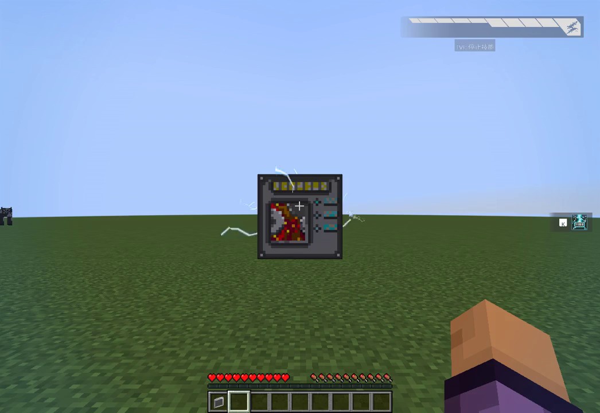

# AcademyCraft: Reborn · Minecraft 1.21.1 NeoForge 移植（M41 开发测试版）

## 原作者与特别致谢

**本项目基于 [Lambda Innovation 的 AcademyCraft 原作者仓库](https://github.com/LambdaInnovation/AcademyCraft)。原作者及贡献者的开源工作是本移植的核心基础。**

AcademyCraft 原项目提供的玩法设计、经典源码、美术与音效资源，以及行为实现参考，对本移植起到了关键作用。感谢 Lambda Innovation 与原项目贡献者开放源码，使这些内容能够被研究、保留并适配到新的 Minecraft 环境。请优先了解和支持原作者项目。

- 原作者仓库：https://github.com/LambdaInnovation/AcademyCraft
- 经典参考版本：Minecraft **1.7.10 / AcademyCraft 1.0.7**，参考提交 `00d19ec0cf538f61c1095c9292f5ee6863db4521`
- 移植目标：Minecraft **1.21.1 / NeoForge 21.1.252 / Java 21**
- 本仓库是**第三方移植开发项目，非原作者官方发行版**，不代表原作者为本移植背书

## 当前版本与使用提醒

本次公开的是 **M41 开发测试源码快照**。完整复刻、完整自然生存流程，以及原版引擎下的完整视听一致性验收仍未完成；请勿将其视为正式稳定版。测试时使用独立游戏实例，并备份存档。

本仓库保留源代码、测试资源、构建脚本、技术说明及许可证。运行日志、私人运行状态、存档证据、录制素材和构建缓存未纳入公开源码；下方历史验收文档中提到的 `docs/runtime-evidence/` 原始记录因此不会在本仓库提供。保留的验收说明描述此前检查，不表示本次上传重新运行了构建或游戏测试。

## M41 游戏实况截图

以下为**命令辅助测试场景中的真实游戏录制截图**，使用显式设置的技能、等级、资源及场地。截图展示实际输入与渲染效果，不代表完整自然生存流程、伤害验证或原版视听完全一致性已通过验收。

### Light Shield 护盾（19.9 秒）

### Ray Barrage 射线（58.5 秒）

### Meltdowner 第一人称近镜头光束（13.1 秒）

这一近镜头画面尚未通过原版引擎同视角的像素对照验收。

### Metal Former 接收端充能（11.8 秒）

## 许可与原作者权利

原作者仓库声明采用 **GPLv3，并附有额外限制和版权声明**。本仓库完整保留 [LICENSE](LICENSE)、[NOTICE](NOTICE) 与相关第三方许可，不移除原作者署名，不擅自重新许可，也不宣称解决这些条款之间的法律兼容性或效力问题。使用、修改或再分发前，请阅读原作者条款及本仓库声明。原作者附加声明包含禁售等要求；第三方歌曲及歌曲专属素材不包含在本项目中。

以下为随 M41 保留的构建、功能及验收边界说明。

---

This is the M41 development source checkpoint and playable candidate. The faithful full-port acceptance is still open. The canonical baseline is Lambda Innovation AcademyCraft **1.0.7**, commit `00d19ec0cf538f61c1095c9292f5ee6863db4521`, for Minecraft 1.7.10. The 1.12.2 branch is only a secondary reference.

## Run and build

Use Minecraft **1.21.1**, NeoForge **21.1.252**, and **Java 21** in an independent game profile. Put the development JAR into that profile's `mods` directory. Keep backups before opening existing worlds. No LambdaLib runtime is needed.

To build source, install a full JDK21 and run `./gradlew build` or `gradlew.bat build`. The wrapper pins Gradle8.10.2 and ModDevGradle2.0.148. First build downloads the official Minecraft/NeoForge toolchain. Outputs are in `build/libs`; native GameTest classes are excluded from the JAR. The cloud-only `scripts/gradle-cloud.sh` is unnecessary on an ordinary developer machine.

## Current integrated scope

- All35 classic active skill paths across Electromaster, Meltdowner, Teleporter and Vector Manipulation, with server-authoritative skill gating, charged/toggled sessions, actual finite costs, cooldowns and source-derived visual timelines
- The50-entry source catalog:35 active skills,3 category passives and12 generic course instances. A catalog count is not a naturally obtained-skill count
- Finite portable, Normal and Advanced developers, authentic eight-cell structures and source OBJ rendering, the animated source tree/editor/console and completion-validated stimulation
- Native ores/materials and phase liquid acquisition/worldgen, genuine phase/matter containers and Imag Fusor progression;49 classic default recipe equivalents plus4 standalone RF recipes
- Source Solar, Phase and Wind generators, Silicon Barn, Magnetic Hook, three-tier wireless nodes and eight-cell matrix; source creative-only Cat Engine and Ability Interferer; hidden source display items
- RF input/output through a directional NeoForge FE adapter, with one finite IF store,1IF=4FE, source2,000IF capacity, original recipes and wireless screens
- The14-entry guide, classic terminal with Skill Tree/Frequency/Media apps,56 source achievements with real event/parent gates and five classic pages
- Four original language dictionaries, native persistent state and bounded network synchronization

See `docs/m28-classic-progress-event-checkpoint.md`, `docs/m27-classic-fresh-cache-and-developer-ui.md`, `docs/m26-classic-category-lifecycle-checkpoint.md` and earlier device checkpoints for exact acceptance boundaries. All35 skill GUI/effect paths have bounded actual-client checks with declared prerequisite/level/material setup. Actual higher-developer collection/fusion/crafting/power chains are verified. A generated-material native fixture now continues through ordinary singleplayer random category acquisition, root learning, binding, real item transfer and separate-client-JVM cold restore. Its supplied tools/poses, residency and accelerated native clocks remain declared; complete unassisted survival progression is still open.

## Controls and progression

Normal game defaults use right-click to open held portable developers and interact with hardware. Initial acquisition takes five stimulations; first-skill learning takes three. Portable supports level1/2, with26ticks and780IF per stimulation. An inventory induction factor selects the initial category; otherwise acquisition is random. Energy depletion or switching away aborts without refund; closing the portable GUI alone does not abort.

Classic defaults: short V toggles/cancels ability control; holding V displays CP/overload without toggling. C cycles four gameplay presets, N opens their editor. Slots default to LMB, RMB, R and F; new presets are empty, so bind learned skills before casting. Editing another page does not select it. Existing saved key bindings can override defaults. Recorded QA profiles have per-clip declared bindings; M26/M27 use K for ability slot0, J for vanilla attack and U for item use. Short Alt opens the installed classic terminal.

`/academy status` reads authoritative state. Operator-only `/academy dev <category>` and `/academy dev charge <0..10000>` are explicitly marked fixture helpers. They do not demonstrate natural acquisition or progression. Source creative-only Cat/Interferer and hidden display items have no invented survival recipes. Interferer deliberately retains the original non-persisted placer and stored-but-unused whitelist behavior.

## Acceptance still required

Original per-skill configuration, Vector entity-affection settings, legacy commands, float mutation boundaries and fresh resource/cache timing now have focused source/native acceptance. Remaining full-replica work includes activation/deactivation and administrative raw-XP observer delivery, client event/sync transport, complete unassisted survival progression, broader world-generation/acquisition and source-versus-port render/action comparisons, audible audio and external multiplayer/optional integration acceptance. The RF/FE boundary necessarily adapts modern capability and conservation contracts. Optional IC2 requires a genuine compatible modern dependency and is not represented by placeholder machines. Source third-party songs and song-specific assets are excluded; Media supports permitted existing tracks and user local files.

Actual game-process audio is now captured through the private OpenAL Wave File Writer. Raw video and original stereo float32 audio masters are preserved, and M41 delivery copies contain unchanged H264 video with AAC of that real game mix. Capture-start alignment is approximate; full human listening and complete 1.7.10 audiovisual parity remain unaccepted. Build success, content counts and reused artwork do not establish those results. Read `docs/classic-content-audit-m21.md`, `docs/visual-fidelity.md` and the detailed skill/device documentation.

## Rights

Preserve `NOTICE` and `LICENSE`. Upstream declares GPLv3 **and additional restrictions**; this port does not resolve their legal interaction. Third-party media songs and associated song-specific assets are excluded. This public repository preserves a development source checkpoint; publication does not grant permission to sell or remove upstream restrictions.

M29 activation and direct XP checkpoint: [source behavior and exact acceptance](docs/m29-classic-activation-setxp-checkpoint.md). Full check/JAR, 366 native fixtures, command/configuration and distinct disk JVM probes pass; new actual-client continuation and complete unassisted/full audiovisual acceptance remain open.

M31 far-coordinate Arc/railgun rendering: [actual geometry and client acceptance](docs/m31-camera-relative-render-checkpoint.md). Full check/JAR passes; real earned-world block casts and closed float ledgers are verified with fixture limits. Full original audiovisual acceptance remains open.

M30 reviewed activation transport checkpoint on M31 graphics: [prediction, observer ordering and reconciliation acceptance](docs/m30-activation-transport-checkpoint.md). Full check/JAR and368native fixtures plus command/config/disk probes pass; actual new-client/source key-group/scheduler fidelity remains open.

M32 original ArcFactory geometry checkpoint: [unchanged-source mesh/RNG and actual-client evidence](docs/m32-original-arc-geometry-checkpoint.md). Fullcheck/JAR and real toggle/disabled-input/two blockArc closed-ledger acceptance pass with fixture limits; original engine/all visual/audio and client group/sync parity remain open.

M35 held energy-item presentation: [narrow re-equip fix and actual-client comparison](docs/m35-held-energy-item-checkpoint.md). Full check/JAR and372 native tests pass. Actual earned Arc mastery now continues through the30% prerequisite, ordinary Charging learning, finite portable charging to10,000IF and a new-client-JVM cold restore, with the existing material fixture limits. Continuous charging keeps the held developer visible; full original audiovisual and unassisted survival acceptance remain open. The isolated M34 client runtime work is not included.

M36 client runtime integration: [source ordering, scoped contexts and actual-client acceptance](docs/m36-classic-client-runtime-checkpoint.md). This checkpoint includes the reviewed M34 adapter on M35. Full check/JAR and380 native tests pass; the portable unchanged-source oracle executes2236 assertions against ten actual main coordinator classes. Real finite-CP input keeps two accepted Vector contexts across a preset switch and terminates them individually with V. The Vector setup is explicitly command-assisted. Charging also passes on an unchanged whole-world earned replay clone. Six legacy skill input-identity protocols remain under review for M37; XP/CP part timing, all original audiovisual and complete unassisted progression remain open.

M41 Charging/Meltdowner camera boundaries: [current acceptance and remaining limits](docs/m41-meltdowner-camera-status.md). Full check/JAR passes 211 tasks; actual compiled renderer geometry regressions retain explicit CPU host limits. A real charge receiver and the three Meltdowner renderer families visibly render at far coordinates in separately declared command-assisted fixtures, with real input and closed ledgers. Original silent raw clips and actual game-audio masters are preserved. This is a development candidate, not completed unassisted survival or original-engine pixel/audio acceptance.
